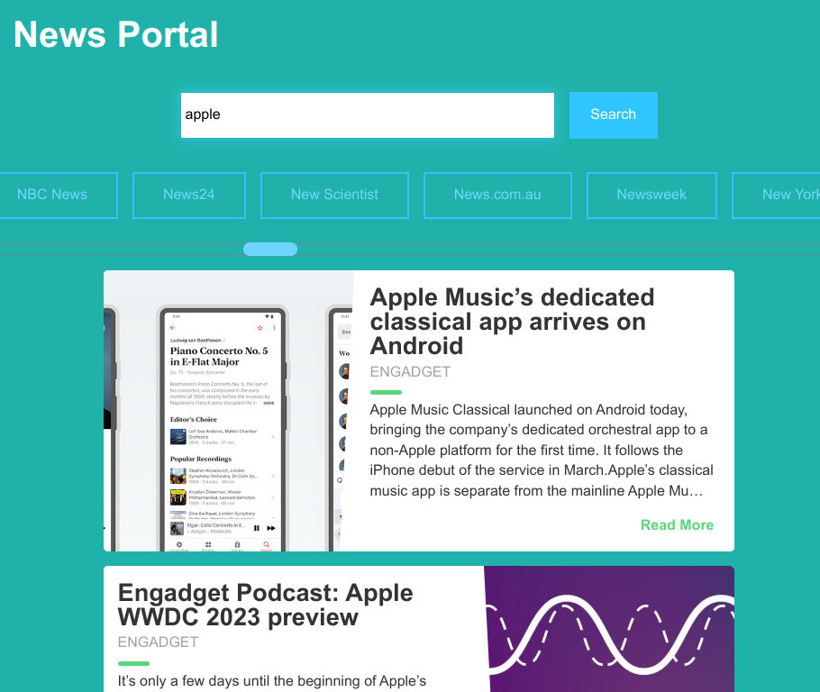

# News App

App using HTTP REST API for searching and retrieving news from all over the web


## Deploy

https://alexpashchuk-news-api.netlify.app

## Install instructions:

```bash
1. git clone https://github.com/alexpashchuk/news-api
2. npm i
3. npm run start
```

### Used technologies

- JavaScript
- TypeScript
- CSS
- Rest API
- Eslint
- Webpack

## Screenshot


